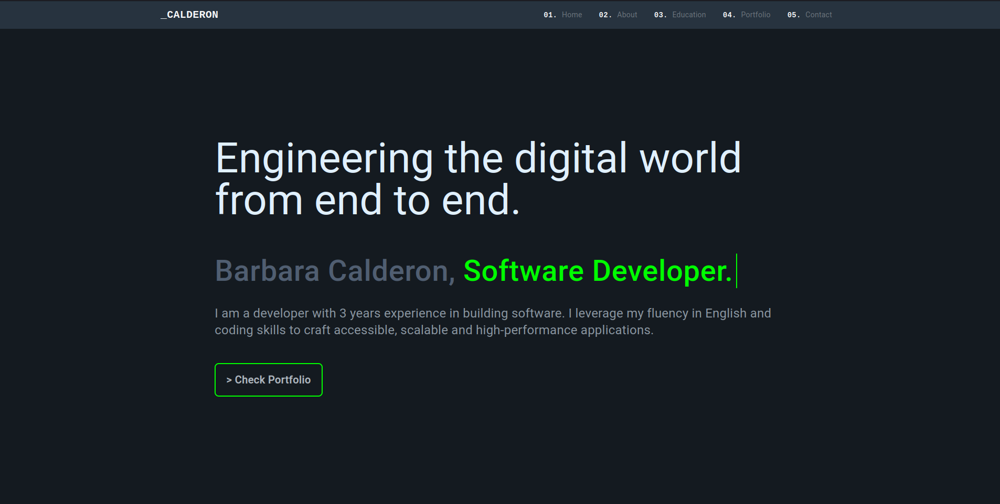

# PB | Angular Portfolio App

This is my personal portfolio website built with Angular, Typescript, HTML5, CSS3, Bootstrap, Ngx-Bootstrap, DevIcons, and Angular Material. It's currently deployed on the web:  
🔗 [https://angular-portfolio-app-omega.vercel.app/](https://angular-portfolio-app-omega.vercel.app/)



This project was generated using [Angular CLI](https://github.com/angular/angular-cli) version 17.3.7.

---

## 👨‍💻 Author

I'm **Pakin Basker P**, a software engineer passionate about building clean, scalable systems using .NET, Angular, and Python.

- [GitHub](https://github.com/pakinbaskerp)
- [LinkedIn](https://www.linkedin.com/in/pakin-basker-p-69b05b232)

---

## 🚀 The Project

This portfolio is a **dynamic and responsive web application** built using **Angular**, showcasing my skills, work experience, and personal projects. It is designed to highlight key areas of my software journey including backend engineering, API design, and scalable systems.

📁 Sections include:
- Home  
- About  
- Education  
- Experience  
- Projects  
- Contact  

🎯 Key features:
- Responsive layout
- Component-based architecture
- Clean, modern UI
- Interactive content display

---

## 🛠️ Technologies Used

- Angular CLI
- Angular 17
- Angular Material
- TypeScript
- HTML5
- CSS3
- Bootstrap 5
- Ngx-Bootstrap
- DevIcons
- Vercel (deployment)
- Vite

---

## 🔧 Development

To run this project locally:

```bash
git clone https://github.com/pakinbaskerp/angular-portfolio.git
cd angular-portfolio
npm install
ng serve
